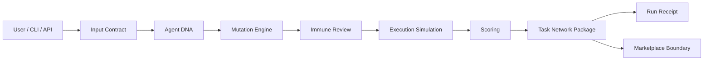
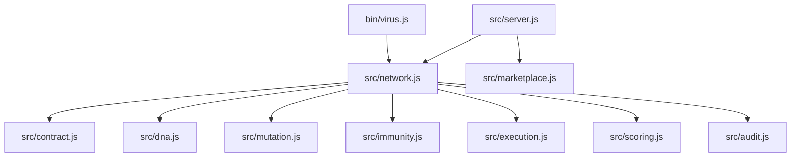
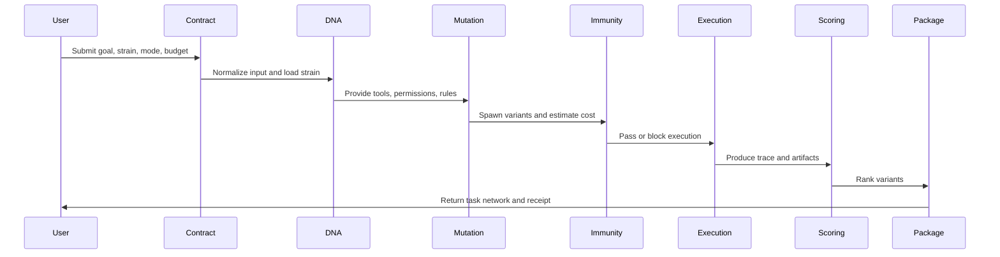

# VIRUS Protocol

VIRUS is a local-first agent replication protocol for spawning, mutating, reviewing, scoring, and packaging reusable AI task networks.

The current repository is an MVP runtime. It does not require an API key, database, blockchain node, or external model provider. The goal is to establish the core protocol loop first, then make each part replaceable with real LLMs, tool adapters, persistence, payments, and marketplace infrastructure.

## Table of Contents

- [Project Information](#project-information)
- [What VIRUS Is](#what-virus-is)
- [Project Status](#project-status)
- [Core Features](#core-features)
- [Technical Architecture](#technical-architecture)
- [Runtime Flow](#runtime-flow)
- [Repository Structure](#repository-structure)
- [Installation](#installation)
- [CLI Usage](#cli-usage)
- [HTTP API](#http-api)
- [Configuration](#configuration)
- [Agent DNA](#agent-dna)
- [Immune Review](#immune-review)
- [Scoring Model](#scoring-model)
- [Marketplace Boundary](#marketplace-boundary)
- [Testing](#testing)
- [Roadmap](#roadmap)
- [FAQ](#faq)

## Project Information

| Item | Value |
| --- | --- |
| Project name | VIRUS Protocol |
| Repository | [mmenicah84/virus-protocol](https://github.com/mmenicah84/virus-protocol.git) |
| Website | TBD |
| X / Twitter | TBD |
| Current stage | MVP runtime |
| License | MIT |

## What VIRUS Is

VIRUS turns one objective into a task network:

1. Normalize the user input.
2. Load an Agent DNA strain.
3. Spawn strategy variants.
4. Run immune review.
5. Execute deterministic local simulations.
6. Score and rank variants.
7. Package artifacts, audit events, and a run receipt.

The name is framed as a product metaphor: intelligent execution that can replicate, mutate, and spread across work surfaces while staying human-controlled and reviewable.

## Project Status

Current stage: `MVP runtime`

Implemented:

- Local CLI runtime.
- Local HTTP API.
- Built-in Agent DNA strains.
- Mutation modes.
- Immune review.
- Deterministic execution simulation.
- Variant scoring.
- Audit trail.
- Run receipt.
- In-memory marketplace boundary.
- Unit tests.
- Static website and brand prototype.

Not implemented yet:

- Real LLM execution.
- Real external tool adapters.
- Persistent storage.
- Authentication.
- Hosted runtime.
- On-chain VRS payments.
- Production marketplace.

## Core Features

### Agent DNA

Agent DNA defines what a strain is allowed to do:

- Goals and summary.
- Tool plan.
- Memory scope.
- Permissions.
- Mutation rules.
- Immune rules.
- Reward shape.

### Mutation Engine

One goal can spawn multiple variants:

- `baseline`
- `fast`
- `precise`
- `low_cost`
- `audit_heavy`

### Immune Review

The immune layer checks:

- Unsafe intent.
- Short or unclear goals.
- Budget pressure.
- Unsafe permissions.
- Public host memory scope.

### Execution Simulation

The MVP does deterministic local execution instead of calling an LLM. Each variant produces:

- Execution status.
- Duration estimate.
- Confidence estimate.
- Artifacts.
- Step trace.

### Scoring

Variants are scored by:

- Quality.
- Reuse potential.
- Risk.
- Estimated cost.
- Immune review status.

### Packaging

Each task network returns:

- Network ID.
- Normalized input.
- Strain DNA.
- Mutation mode.
- Reviewed variants.
- Immune findings.
- Audit trail.
- Selected artifacts.
- Run receipt.

## Technical Architecture



### Module Architecture



## Runtime Flow



## Repository Structure

```text
.
├── assets/
│   └── virus-avatar.svg
├── bin/
│   └── virus.js
├── src/
│   ├── audit.js
│   ├── contract.js
│   ├── dna.js
│   ├── execution.js
│   ├── immunity.js
│   ├── index.js
│   ├── marketplace.js
│   ├── mutation.js
│   ├── network.js
│   ├── scoring.js
│   └── server.js
├── test/
│   └── network.test.js
├── index.html
├── script.js
├── styles.css
├── package.json
└── README.md
```

## Installation

Requirements:

- Node.js `>=20`
- npm

Install dependencies:

```bash
npm install
```

There are currently no external runtime dependencies.

## CLI Usage

Run a demo:

```bash
npm run demo
```

Run a task network:

```bash
node ./bin/virus.js run "Analyze a competitor" --strain research --mode precise
```

Print full JSON:

```bash
node ./bin/virus.js run "Analyze a competitor" --strain research --mode precise --json
```

List built-in strains:

```bash
node ./bin/virus.js strains
```

Health check:

```bash
node ./bin/virus.js health
```

### CLI Options

| Option | Description | Default |
| --- | --- | --- |
| `--strain` | Built-in strain ID. Supports `research`, `code`, `audit`, `market`. | `research` |
| `--mode` | Mutation mode. Supports `balanced`, `fast`, `precise`, `low_cost`. | `balanced` |
| `--host` | Execution host. Supports `local`, `public`, `repository`, `cloud`. | `local` |
| `--budget` | VRS budget for the run. | `40` |
| `--json` | Print the full task network JSON. | `false` |

## HTTP API

Start the local API:

```bash
npm start
```

Default port:

```text
8787
```

### `GET /health`

Returns runtime health.

```bash
curl http://localhost:8787/health
```

Example response:

```json
{
  "ok": true,
  "service": "virus-runtime",
  "version": "0.1.0"
}
```

### `GET /strains`

Returns built-in and published strains.

```bash
curl http://localhost:8787/strains
```

### `POST /run`

Creates a task network.

```bash
curl -X POST http://localhost:8787/run \
  -H "content-type: application/json" \
  -d "{\"goal\":\"Analyze a Web3 AI agent project\",\"strain\":\"research\",\"mode\":\"balanced\"}"
```

Request body:

```json
{
  "goal": "Analyze a Web3 AI agent project",
  "strain": "research",
  "mode": "balanced",
  "host": "local",
  "budgetVrs": 40,
  "metadata": {}
}
```

Response includes:

- `id`
- `input`
- `strain`
- `mutationMode`
- `variants`
- `immuneReview`
- `summary`
- `auditTrail`
- `package`
- `receipt`

### `POST /strains`

Publishes a custom Agent DNA entry into the in-memory marketplace.

```bash
curl -X POST http://localhost:8787/strains \
  -H "content-type: application/json" \
  -d "{\"id\":\"ops\",\"name\":\"Ops-Strain\",\"tools\":[\"logs\"],\"permissions\":[\"read:logs\"],\"mutationRules\":[\"incident_split\"],\"immunityRules\":[\"permission_check\"],\"reward\":{\"success\":\"incident_resolved\",\"reuse\":\"runbook\"}}"
```

The MVP marketplace is in-memory only. Published strains reset when the server restarts.

## Configuration

### Environment Variables

| Variable | Description | Default |
| --- | --- | --- |
| `PORT` | Local HTTP API port. | `8787` |

Example:

```bash
PORT=9000 npm start
```

### Runtime Defaults

| Setting | Default |
| --- | --- |
| Strain | `research` |
| Mode | `balanced` |
| Host | `local` |
| Budget | `40 VRS` |
| Request body limit | `64 KB` |

## Agent DNA

Built-in strains are defined in `src/dna.js`.

Example:

```js
{
  id: "research",
  name: "Research-Strain",
  tools: ["search", "documents", "citations", "summarizer"],
  memoryScope: "project",
  permissions: ["read:web", "read:docs"],
  mutationRules: ["compare_sources", "challenge_claims", "compress_findings"],
  immunityRules: ["source_check", "privacy_check", "budget_check"],
  reward: {
    success: "validated_findings",
    reuse: "report_template"
  }
}
```

Required DNA fields:

- `id`
- `name`
- `tools`
- `permissions`
- `mutationRules`
- `immunityRules`
- `reward`

## Immune Review

The immune layer is designed to make replication controllable.

Current checks:

- `goal_too_short`
- `blocked_intent`
- `budget_exceeded`
- `unsafe_permission`
- `public_host_memory`

High-severity findings block execution. Medium findings are returned as warnings but do not block the MVP run.

## Scoring Model

The MVP score is deterministic:

```text
score = qualityScore + reuseScore - riskPenalty - costPenalty - blockedPenalty
```

Where:

- `qualityScore = quality * 48`
- `reuseScore = reuse * 32`
- `riskPenalty = risk * 24`
- `costPenalty = min(18, estimatedCostVrs * 0.9)`
- `blockedPenalty = 42` when immune review blocks the task

This model is intentionally simple so it can be audited, replaced, or tuned later.

## Marketplace Boundary

The MVP marketplace is an in-memory registry.

It supports:

- Listing strains.
- Finding strains.
- Publishing valid Agent DNA.
- Rejecting duplicate IDs.
- Rejecting invalid DNA.

Future versions should add:

- Persistent storage.
- Creator identity.
- Versioning.
- Usage metrics.
- Revenue routing.
- VRS staking and ranking.

## Testing

Run tests:

```bash
npm test
```

Current test coverage checks:

- Task Network creation.
- Unsafe goal blocking.
- Built-in strain listing.
- Runtime input normalization.
- Invalid input rejection.
- Budget warning behavior.
- Marketplace publishing boundaries.

## Project Website

The repository includes a static website prototype:

- `index.html`
- `styles.css`
- `script.js`
- `assets/virus-avatar.svg`

Open `index.html` directly in a browser to preview the landing page.

## Roadmap

### Phase 1: MVP Runtime

Timeline: May 2026

- Local CLI.
- Local HTTP API.
- Deterministic execution simulation.
- Audit trails.
- In-memory marketplace.

### Phase 2: Real Agent Execution

Timeline: June 2026

- LLM provider adapters.
- Tool adapters.
- Streaming logs.
- Host permissions.
- Persistent task records.

### Phase 3: Developer Marketplace

Timeline: July 2026

- Agent DNA publishing.
- Versioned strain registry.
- Creator profiles.
- Usage analytics.
- Marketplace scoring.

### Phase 4: VRS Protocol Economy

Timeline: August 2026 and beyond

- VRS payments.
- Creator rewards.
- Staking-based ranking.
- Governance parameters.
- Ecosystem funding.

## FAQ

### Is this connected to a real LLM?

Not yet. The MVP uses deterministic local execution simulation so the protocol loop can be tested without API keys or external dependencies.

### Why is it local-first?

Local-first makes the runtime easy to inspect, test, fork, and upload to GitHub before adding hosted infrastructure.

### Is VRS implemented on-chain?

No. VRS is represented as an accounting unit in the MVP. On-chain payment, staking, and governance are future milestones.

### Does the runtime execute real shell commands?

No. The MVP does not execute real shell commands from Agent DNA. It simulates execution routes and produces artifacts.

### Can custom strains be published?

Yes, through the in-memory marketplace boundary. Custom DNA must include all required fields and use a unique ID.

### Is the marketplace persistent?

No. The current marketplace resets when the server restarts.

### Can the scoring model be changed?

Yes. The scoring model is isolated in `src/scoring.js` so it can be tuned or replaced.

### Is the website required to run the runtime?

No. The website is a static product prototype. The runtime works through CLI and HTTP API.

## License

MIT
