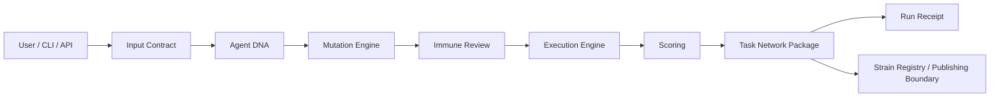
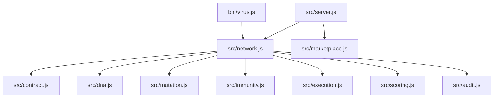
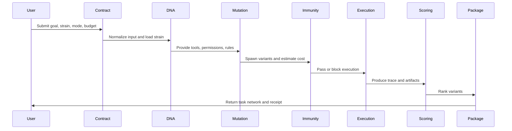

<p align="center">
  
</p>

<h1 align="center">VIRUS Protocol</h1>

VIRUS is a local-first agent replication protocol for spawning, mutating, reviewing, scoring, and packaging reusable AI task networks.

The current repository ships VIRUS Runtime v1: a self-contained local product for building, running, reviewing, scoring, and storing reusable agent task networks. It runs without mandatory external services while keeping clean integration boundaries for model providers, tool adapters, hosted storage, metering, and publishing infrastructure.

## Table of Contents

- [Project Information](#project-information)
- [What VIRUS Is](#what-virus-is)
- [Product Status](#product-status)
- [Core Features](#core-features)
- [Technical Architecture](#technical-architecture)
- [Runtime Flow](#runtime-flow)
- [Repository Structure](#repository-structure)
- [Installation](#installation)
- [CLI Usage](#cli-usage)
- [HTTP API](#http-api)
- [Configuration](#configuration)
- [Agent DNA](#agent-dna)
- [Immune Review](#immune-review)
- [Scoring Model](#scoring-model)
- [Strain Registry Boundary](#strain-registry-boundary)
- [Testing](#testing)
- [Project Website](#project-website)
- [Changelog](#changelog)
- [Roadmap](#roadmap)
- [FAQ](#faq)

## Project Information

| Item | Value |
| --- | --- |
| Project name | VIRUS Protocol |
| Repository | [mmenicah84/virus-protocol](https://github.com/mmenicah84/virus-protocol.git) |
| Website | [viruslabs.fun](https://viruslabs.fun) |
| X / Twitter | [@VirusProtocolHQ](https://x.com/VirusProtocolHQ) |
| Version | 1.0.1 |
| Current stage | Runtime v1 |
| License | MIT |

## What VIRUS Is

VIRUS turns one objective into a task network:

1. Normalize the user input.
2. Load an Agent DNA strain.
3. Spawn strategy variants.
4. Run immune review.
5. Execute local deterministic runs.
6. Score and rank variants.
7. Package artifacts, audit events, and a run receipt.

The name is framed as a product metaphor: intelligent execution that can replicate, mutate, and operate across work surfaces while staying human-controlled and reviewable.

## Product Status

Current stage: `Runtime v1`

Runtime v1 includes:

- Local CLI runtime.
- Local HTTP API.
- Built-in Agent DNA strains.
- Mutation modes.
- Immune review.
- Local deterministic execution engine.
- Variant scoring.
- Audit trail.
- Run receipt.
- Local JSON persistence for task networks and custom strains.
- Strain registry and publishing boundary for built-in and custom strains.
- Unit tests.
- Product website and brand system.

Expansion layers:

- LLM provider adapters.
- External tool adapters.
- Authentication.
- Hosted runtime.
- Optional publishing boundary.

## Core Features

### Agent DNA

Agent DNA defines what a strain is allowed to do:

- Goals and summary.
- Tool plan.
- Memory scope.
- Permissions.
- Mutation rules.
- Immune rules.
- Reward shape.

### Mutation Engine

One goal can spawn multiple variants:

- `baseline`
- `fast`
- `precise`
- `low_cost`
- `audit_heavy`

### Immune Review

The immune layer checks:

- Unsafe intent.
- Short or unclear goals.
- Budget pressure.
- Unsafe permissions.
- Public host memory scope.

### Execution Engine

Runtime v1 uses a local deterministic execution engine. Each variant produces:

- Execution status.
- Duration estimate.
- Confidence estimate.
- Artifacts.
- Step trace.

### Scoring

Variants are scored by:

- Quality.
- Reuse potential.
- Risk.
- Estimated cost.
- Immune review status.

### Packaging

Each task network returns:

- Network ID.
- Normalized input.
- Strain DNA.
- Mutation mode.
- Reviewed variants.
- Immune findings.
- Audit trail.
- Selected artifacts.
- Run receipt.

## Technical Architecture



### Module Architecture



## Runtime Flow



## Repository Structure

```text
.
|-- assets/
|   `-- virus-avatar.svg
|-- bin/
|   `-- virus.js
|-- data/
|   `-- .gitkeep
|-- scripts/
|   `-- install.sh
|-- src/
|   |-- audit.js
|   |-- contract.js
|   |-- dna.js
|   |-- execution.js
|   |-- immunity.js
|   |-- index.js
|   |-- marketplace.js
|   |-- mutation.js
|   |-- network.js
|   |-- scoring.js
|   |-- server.js
|   |-- storage.js
|   `-- version.js
|-- test/
|   `-- network.test.js
|-- index.html
|-- script.js
|-- styles.css
|-- package.json
`-- README.md
```

## Installation

Requirements:

- Node.js `>=20`
- npm

Install dependencies:

```bash
npm install
```

There are currently no external runtime dependencies.

One-command source install:

```bash
curl -fsSL https://raw.githubusercontent.com/mmenicah84/virus-protocol/main/scripts/install.sh | bash
```

Installer environment variables:

| Variable | Description | Default |
| --- | --- | --- |
| `VIRUS_REPO` | Git repository URL used by the installer. | `https://github.com/mmenicah84/virus-protocol.git` |
| `VIRUS_DIR` | Local install directory. | `virus-protocol` |
| `VIRUS_SKIP_TESTS` | Set to `1` to skip the installer test run. | `0` |

## CLI Usage

Run a demo:

```bash
npm run demo
```

Run a task network:

```bash
node ./bin/virus.js run "Analyze a competitor" --strain research --mode precise
```

Print full JSON:

```bash
node ./bin/virus.js run "Analyze a competitor" --strain research --mode precise --json
```

List built-in strains:

```bash
node ./bin/virus.js strains
```

List stored task networks:

```bash
node ./bin/virus.js networks
```

Show one stored task network:

```bash
node ./bin/virus.js show vnet_12345678
```

Health check:

```bash
node ./bin/virus.js health
```

### CLI Options

| Option | Description | Default |
| --- | --- | --- |
| `--strain` | Built-in or published strain ID. Built-ins are `research`, `code`, `audit`, `market`. | `research` |
| `--mode` | Mutation mode. Supports `balanced`, `fast`, `precise`, `low_cost`. | `balanced` |
| `--host` | Execution host. Supports `local`, `public`, `repository`, `cloud`. | `local` |
| `--budget` | VIRUS budget for the run. | `40` |
| `--json` | Print the full task network JSON. | `false` |

## HTTP API

Start the local API:

```bash
npm start
```

Default port:

```text
8787
```

### `GET /health`

Returns runtime health.

```bash
curl http://localhost:8787/health
```

Example response:

```json
{
  "ok": true,
  "service": "virus-runtime",
  "version": "1.0.1"
}
```

### `GET /strains`

Returns built-in and published strains.

```bash
curl http://localhost:8787/strains
```

### `POST /run`

Creates a task network.

```bash
curl -X POST http://localhost:8787/run \
  -H "content-type: application/json" \
  -d "{\"goal\":\"Analyze a Web3 AI agent project\",\"strain\":\"research\",\"mode\":\"balanced\"}"
```

Request body:

```json
{
  "goal": "Analyze a Web3 AI agent project",
  "strain": "research",
  "mode": "balanced",
  "host": "local",
  "budgetVrs": 40,
  "metadata": {}
}
```

Response includes:

- `id`
- `input`
- `strain`
- `mutationMode`
- `variants`
- `immuneReview`
- `summary`
- `auditTrail`
- `package`
- `receipt`

The created network is saved to local JSON storage.

### `GET /networks`

Returns stored task network summaries.

```bash
curl http://localhost:8787/networks
```

### `GET /networks/:id`

Returns one stored task network by ID.

```bash
curl http://localhost:8787/networks/vnet_12345678
```

### `POST /strains`

Publishes a custom Agent DNA entry into the local registry store.

```bash
curl -X POST http://localhost:8787/strains \
  -H "content-type: application/json" \
  -d "{\"id\":\"ops\",\"name\":\"Ops-Strain\",\"tools\":[\"logs\"],\"permissions\":[\"read:logs\"],\"mutationRules\":[\"incident_split\"],\"immunityRules\":[\"permission_check\"],\"reward\":{\"success\":\"incident_resolved\",\"reuse\":\"runbook\"}}"
```

Published strains are saved in local JSON storage and can be used by later runs.

## Configuration

### Environment Variables

| Variable | Description | Default |
| --- | --- | --- |
| `PORT` | Local HTTP API port. | `8787` |
| `VIRUS_DATA_DIR` | Local JSON storage directory. | `data` |

Example:

```bash
PORT=9000 npm start
```

Run with an isolated data directory:

```bash
VIRUS_DATA_DIR=.virus-data npm start
```

### Runtime Defaults

| Setting | Default |
| --- | --- |
| Strain | `research` |
| Mode | `balanced` |
| Host | `local` |
| Budget | `40 VIRUS` |
| Request body limit | `64 KB` |

## Agent DNA

Built-in strains are defined in `src/dna.js`.

Example:

```js
{
  id: "research",
  name: "Research-Strain",
  tools: ["search", "documents", "citations", "summarizer"],
  memoryScope: "project",
  permissions: ["read:web", "read:docs"],
  mutationRules: ["compare_sources", "challenge_claims", "compress_findings"],
  immunityRules: ["source_check", "privacy_check", "budget_check"],
  reward: {
    success: "validated_findings",
    reuse: "report_template"
  }
}
```

Required DNA fields:

- `id`
- `name`
- `tools`
- `permissions`
- `mutationRules`
- `immunityRules`
- `reward`

## Immune Review

The immune layer is designed to make replication controllable.

Current checks:

- `goal_too_short`
- `blocked_intent`
- `budget_exceeded`
- `unsafe_permission`
- `public_host_memory`

High-severity findings block execution. Medium findings are returned as warnings while the runtime continues with controlled execution.

## Scoring Model

The runtime score is deterministic:

```text
score = qualityScore + reuseScore - riskPenalty - costPenalty - blockedPenalty
```

Where:

- `qualityScore = quality * 48`
- `reuseScore = reuse * 32`
- `riskPenalty = risk * 24`
- `costPenalty = min(18, estimatedCostVrs * 0.9)`
- `blockedPenalty = 42` when immune review blocks the task

This model is intentionally simple so it can be audited, replaced, or tuned later.

## Strain Registry Boundary

The Runtime v1 registry is a local store backed by JSON storage for custom strains.

It supports:

- Listing strains.
- Finding strains.
- Publishing valid Agent DNA.
- Rejecting duplicate IDs.
- Rejecting invalid DNA.
- Reusing published custom strains across restarts.

Future versions should add:

- Hosted registry storage.
- Creator identity.
- Versioning.
- Usage metrics.
- Publishing metrics.
- Optional routing and ranking.

## Testing

Run tests:

```bash
npm test
```

Current test coverage checks:

- Task Network creation.
- Unsafe goal blocking.
- Built-in strain listing.
- Runtime input normalization.
- Invalid input rejection.
- Budget warning behavior.
- Strain registry publishing boundaries.
- Local JSON persistence for custom strains and task networks.

## Project Website

The repository includes a product website:

- `index.html`
- `styles.css`
- `script.js`
- `assets/virus-avatar.svg`

Open `index.html` directly in a browser to preview the landing page.

## Changelog

See [CHANGELOG.md](./CHANGELOG.md) for maintenance updates and release notes.

## Roadmap

### Phase 1: Runtime v1

Timeline: May 2026

- Local CLI.
- Local HTTP API.
- Local deterministic execution engine.
- Audit trails.
- Local JSON persistence.
- Source installer script.

### Phase 2: Real Agent Execution

Timeline: June 2026

- LLM provider adapters.
- Tool adapters.
- Streaming logs.
- Host permissions.
- Hosted task records.

### Phase 3: Strain Publishing

Timeline: July 2026

- Agent DNA publishing.
- Versioned strain registry.
- Creator profiles.
- Usage analytics.
- Publishing scoring.

### Phase 4: Hosted Runtime and Metering

Timeline: August 2026 and beyond

- Hosted runtime.
- Metering and receipts.
- Routing boundaries.
- Optional rewards layer.

## FAQ

### Is this connected to a real LLM?

Runtime v1 ships with a deterministic local execution engine. Provider-backed LLM execution is designed as an adapter layer so teams can connect their preferred model stack without changing the protocol loop.

### Why is it local-first?

Local-first makes the runtime easy to inspect, test, fork, and upload to GitHub before adding hosted infrastructure.

### How does VIRUS work in Runtime v1?

VIRUS is represented as the runtime accounting unit in Runtime v1. It is used for estimated cost, scoring, and run receipts inside the local runtime.

### Does the runtime execute real shell commands?

Runtime v1 keeps Agent DNA execution inside controlled task routes and produces auditable artifacts. Direct shell execution belongs behind explicit host adapters and permission gates.

### Can custom strains be published?

Yes, through the strain registry boundary. Custom DNA must include all required fields and use a unique ID.

### Is the registry persistent?

Yes. Custom strains and task networks are stored as local JSON files under `data/` or `VIRUS_DATA_DIR`.

### Can the scoring model be changed?

Yes. The scoring model is isolated in `src/scoring.js` so it can be tuned or replaced.

### Is the website required to run the runtime?

The website is the public product surface. The runtime works through CLI and HTTP API.

## License

MIT
